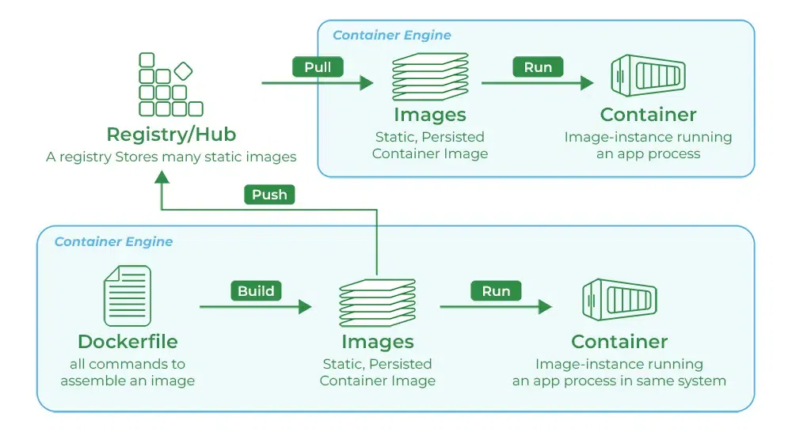
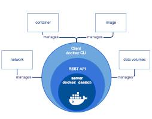

# Docker
  ### What is Docker
  Docker is a platform designed to help devlopers build, share and run container applications.

  ### why do we need dockers
  - Consistency Aross Envirnment
      - Problam : Applications often behave differently in devlopment, testing and production envirnments due to variations in configurations, dependencies and infrastructure
      - Solution : Docker containers encapsulate all the necessary components, ensuring the application runs consistantly across environments
 - Isolation
     - Probalam : Running multiple applications on the same host can lead to confilict , such as dependency clashes or resource contention
     - Solution : Docker provides isolated environments for each application, preventing interferance and ensuring stable performance.
 - Scalability
     - Problam : Scaling applications to handle increased load can be challenging, requiring manual intervention and configuration.
      - Solution : Docker makes it easy to scale application horizontally by running multiple container instances, allowing for quick and efficent scaling.

### How Exactly Docker is used 

#### Understanding Terms in the above diagram

  - #### Docker Engine

      - Docker Engine is the core component of the Docker platform, responsible for creating, running asd managing Docker containers, it serves as the runtime that powers Docker's containerisation capabilities. Here's in-depth look at the docker engine

        

      - Components of Docker Engine
          - Docker Deamon (dockerd):
              - Function : The Docker deamon is the background service running on the host machine. it manages Docker objects such as images, containers, ntworks and volumes.

             - Interacation : It listens for Docker API requests and processes them, handilling container lifecycle operations(start, stop, restart etc)

         - Docker CLI (docker) :
             - Function : The Docker Command line interface(CLI) is the tool that users interact with to communicate with the docker deamon.

             - Usage : Users run Docker commands through the CLI to perform tasks like building images , running containers, and managing Docker resources

         - REST API

             -  Function : The Docker REST API allows communication between the Docker CLI and the Docker deamon. 

             - Usage : Devlopers can use this API to automate Docker operations or integrate Docker functionality into their applications. 

 - #### Docker Image

    - A Docker Image is a light-weight stand-alone and executable softwae packahe that includes everything needed to run a piece of software, such as the code, runtime, libraries, envirnment variables and configuration files. Images are used to create Docker containers, which are instances of these images.

      -  Components of Docker Image

         - Base Image : The starting point for building an image. it could be a minimal OS image like alpine, a full-fledged OS like ubuntu or even another application image like python or node.

         - Application code : The actual code and files are necessary for the application to run.

         - Dependencies : Libraries, framework and packages required by the application.

         - Metadata : Information about the image, such as envirnment variable , lebels and exposed ports.

     - Docker Image Lifecycle

         - Creation : Images are created using the docker build command which processes the instructions in a dockerfile to create the image layers.

         - Storage : Image are stored locally on the host machine. they can also be pushed to and pulled from Docker registries  like Docker Hub, AWS ECR or Google Container Registry

### Docker File

A Dockerfile is a text file that contains a series of instructions used to build a Docker image. Each instruction in a Dockerfile creates a layer in the image, aloowing for efficent image creation ans reuse of layers. Dockerfiles are used to automate the image creation process. ensuring consistancy and reproductibility

   - Key Components of a Dockerfile
      - Base Image (FROM) : Specicies the starting point of the image, which could be a minimal OS, a specific version of a language runtime, or another image. Example FROM ubuntu:20.04

      - Labels (LABEL) : Adds metadata to the image, such as version, description, or maintainer. Example : LABEL version="1.0" description="My applicaton"

      - Run Commands (RUN) : Executes commands in the image during the build process typically used to install software packages.
        Example : 
        RUN apt-get updated && 
        apt-get install -y python3

     - Copy Files (COPY) : Copies files or directories from the host system to the image. Example: COPY ./app

     - Envirnment Variable (ENV) -Sets envirnment varibales in the image. Example ENV PATH/app/bin:$PATH

     - Work Directory (WORKDIR) : Sets the working directory for subsequent instructions. Example : WORKDIR/app

     - Expose Ports (EXPOSE) : Informs docker that the container listens on the specified network ports. Example : EXPOSE8080

     - Command (CMD) - Provides a default command to run when the container starts.
     Example : CMD["python",'app.py"] 

     - Volume [VOLUME] - Creates a mount point with a specified path and marks it as holding externally mounted volumes from the host or other container s. Example : VOLUME ["/data]

     - Argumetns[ARG] - Defines build-time variables. Example : ARG VERSION=1.0

       

### Docker Container
A Docker Container is a light weight, portable and isolated envirnment that encapsulates an application and its dependencies , allowing it to run consistantly across different computing envirnments. Containers are created from docker images, which are immutable and contain all the necessary components fro the application to run.

### Registry
A Docker registry is a service that stores ans distributes Docker images. it acts as repository where users can push , pull and manage Docker Images. Docker Hub is the most well known public registry, nut private registries can also be set up to securely atore and manage images within an orginisation.

#### Key Components of a Docker Registry

  - Repositories : A repository is acollection of related Docker images, typically different versions of the same application. Each repository can hold multiple tags, representing different versions of an image.

  - Tags : Tags are used to version images within a repository. For example myapp:1.0, myapp:2.0 and myapp:latest are tags for different versions of the myapp image.

#### Types of Docker Registries

- Docker Hub:
    - Docker Hub
       - Description : the default public registry provided by Docker, which hosts a vast number of public images and also supports private repositries
       - URL : hub.docker.com
       - Use Case : Publicaly sharing images and acessing a large collection of pre-built images from the community and official repositories.

    - Private Registries:
      - Description : Custom registires set up by orginisations to securely store and manage their own Docker images.
      - Use Case : Ensuring security and control over image distribution within an organization.

    - Third-Party Registries: 
      - Examples: Amazon Elastic Container Registry (ECR), Google Container Registry(GCR), Azure Container Registry (ACR).
      - Use Case: Integrating with cloud platforms for seamless deployment and maangementof images within cloud infrastructure

#### Benefits of Using Docker Registries 

- Centralized Image Management : Registries provide a centralized location to store and manage Docker images, making it easier to organise and distribute them.

- Version Control : Using tags, registries allow version control of image, enabling users to easily rollback to previous versions if needed.

- Collaboration : Public registires like Docker HUb facilitate collaboration by allowing usesrs to share images with the community or within teams.

#### Use-cases

 - Microservices Architecture

    - Description : Microservices break down applications into smaller, independent services, each running in its own container.

    - Benifits : Simplifies deployment, scaling and maintenance. Each service can be devloped, updated and deployed independently 

- Continuous Integration and Continuous Deployment (CI/CD)
  
     - Description : Docker ensures a consistant envirnment from devlopment through testing to production 

     - Benifits : Streamline the CI/CD pipeline, reduces discrepancies between envirnments and speeds up testing and deployment process.

- Cloud Migration

     - Description : Containerizing applications to move them to the cloud .

     - Benifits : Simplifies the migration process, allows applications to run consistantly across different cloud providers and optimizes resources usage

- Scalable Web Applications

     - Descriptions : Deployment web applications in containers for easy scaling.

     - Benefits : simplifies scaling up or down based on traffic , ensures consistant deployment and enhances resource utilization.

- Testing and QA
 
     - Description : Creation consistent envirnments for testing applications.

     - Benefits : Ensures tests are run in envirnments identical to production, speeds up the setup of test envirnments and facilitates automated testing.

- Machine Learning and AI

     - Decription : Deploying machine learning models and AI applications in containers.

     - Benefits : Ensures consistency in the runtime envirnment, simplifies scaling of model traning and interferance and facilitates collaboration and reproducibility.

- API Devlopment and Deployment

     - Description : Development and deployment API(s) in containers.

     - Benefits : Ensures API(s) run consistantly acrosss environmwnts, simplifies scaling and improves deployment speed and reliability
     
     

